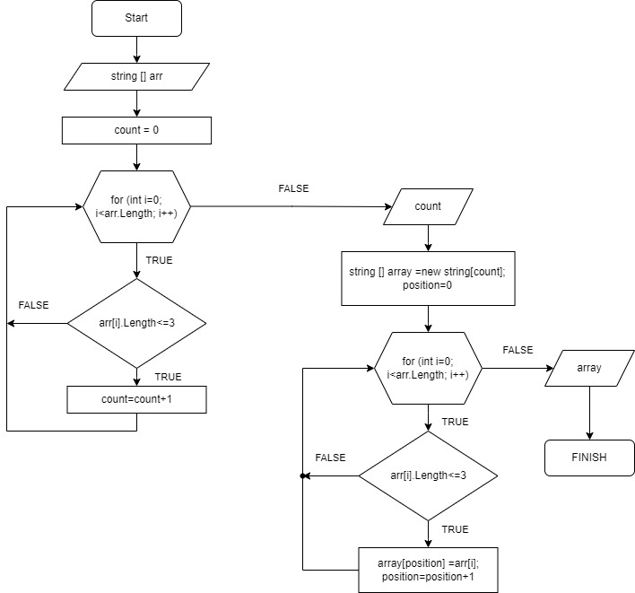

 # Итоговая работа
 ## Задача
 Написать программу, которая из имеющегося массива строк формирует массив из строк, длина которых меньше либо равна 3 символа. Первоначальный массив можно ввести с клавиатуры, либо задать на старте выполнения алгоритма.

 ## Решение
 1. Запросила у пользователя длину массива.
 2. Создала метод для заполнения массива строк обозначенной длины. В данном методе у пользователя поочередно запрашиваются значения каждого элемента.
 3. Создала метод для печати массива.
 4. Создала метод для заполнения итогового массива, где выводятся элементы с количеством символов равным либо менmit трех. В данном методе я
 * определяю длину итогового массива
 * используя полученное значение заполняю новый массив 
 * для заполнения нового массива я использую вспомогательную переменную position, чтобы определить положение элемента в новом массиве.
 5. Вывожу итоговый массив на экран с помощью ранее созданного метода для печати  массива.
## Блок-смема основной содержательной части

